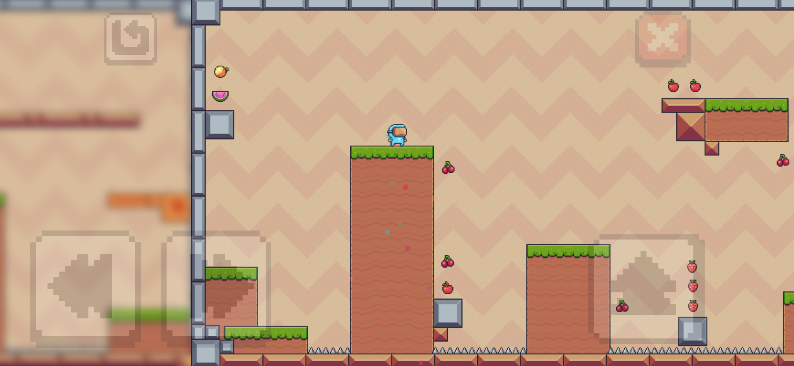
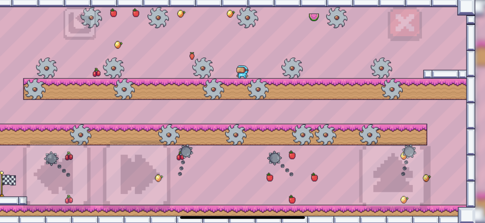
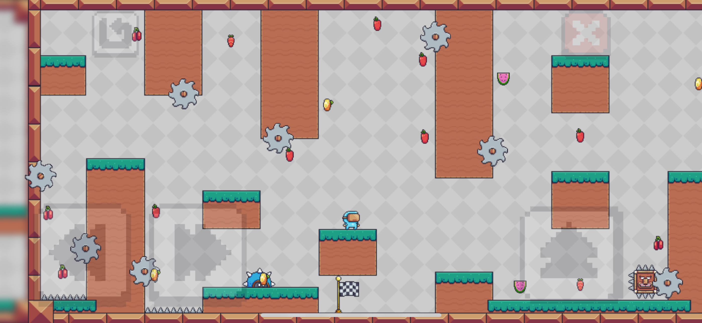
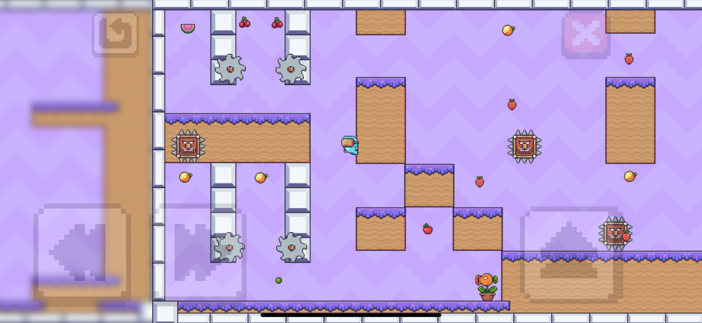
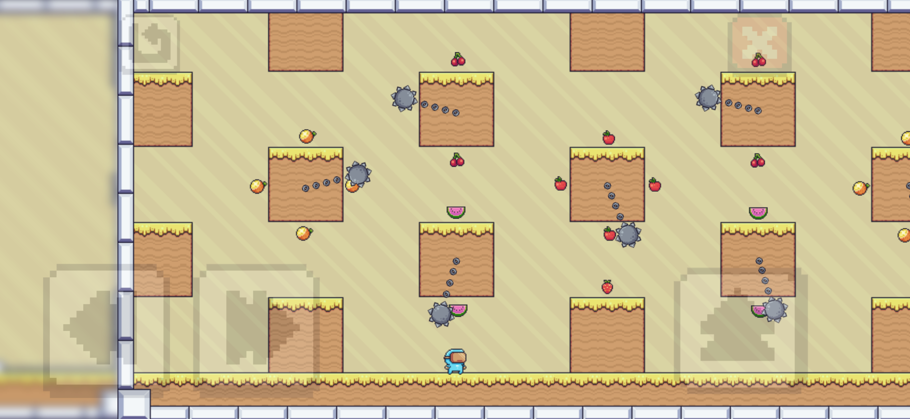
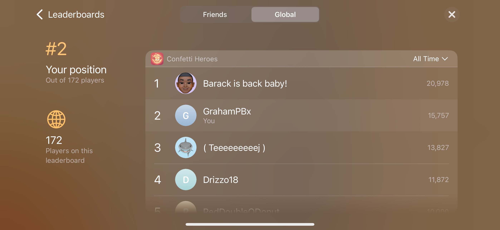
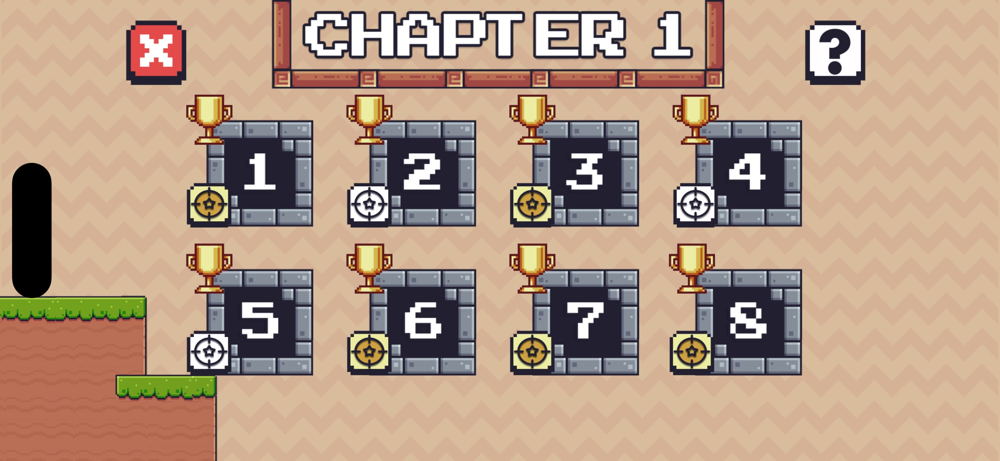
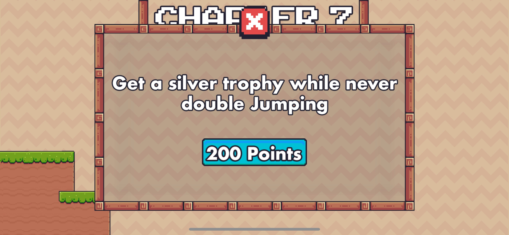

# Confetti Heroes

Welcome to Confetti Heroes, an exciting platformer mobile game featuring thrilling gameplay, engaging challenges, and rewarding experiences. The game has been picked up by publishers, reaching a global audience!

---

## 📋 Features

### 🕹️ Gameplay
- **60 Unique Levels**: Explore diverse and challenging environments, each with its own mechanics and obstacles.
- **Unlockable Rewards**: Collect fruit and complete challenges to unlock skins, characters, and abilities.
- **Global Leaderboards**: Compete with players worldwide for the top spot.

### 💰 Monetization
- **Google AdMob Ads**: Seamlessly integrated banner and interstitial ads to support development.
- **Facebook Ads**: Enhanced user reach and monetization through targeted ad placements.

### 🎯 Additional Features
- **Publisher Recognition**: The game has been picked up by publishers, ensuring widespread distribution and visibility.

---

## 🎮 Screenshots

### Gameplay

### Menus

---

## 📈 Development Highlights
- **Development Stack**:
  - Spritekit for game development.
  - Firebase for backend services and leaderboard integration.
- **Monetization Integration**:
  - Google AdMob and Facebook Ads for monetization.
- **Testing**:
  - Performed extensive QA testing for seamless gameplay on iOS devices.

---

## 🌟 Publisher Recognition

The game has been officially picked up by VooDoo games for test publishing, ensuring it reaches players around the globe. A huge milestone in making this game a success!

## 📝 License

This project is proprietary and not available for replication or redistribution without prior permission.
